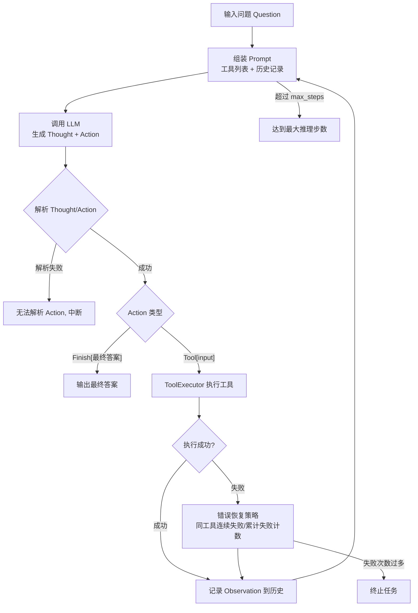
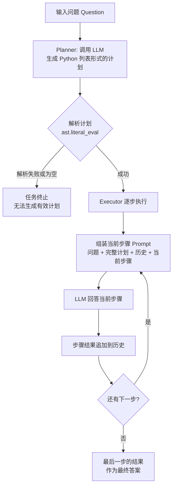
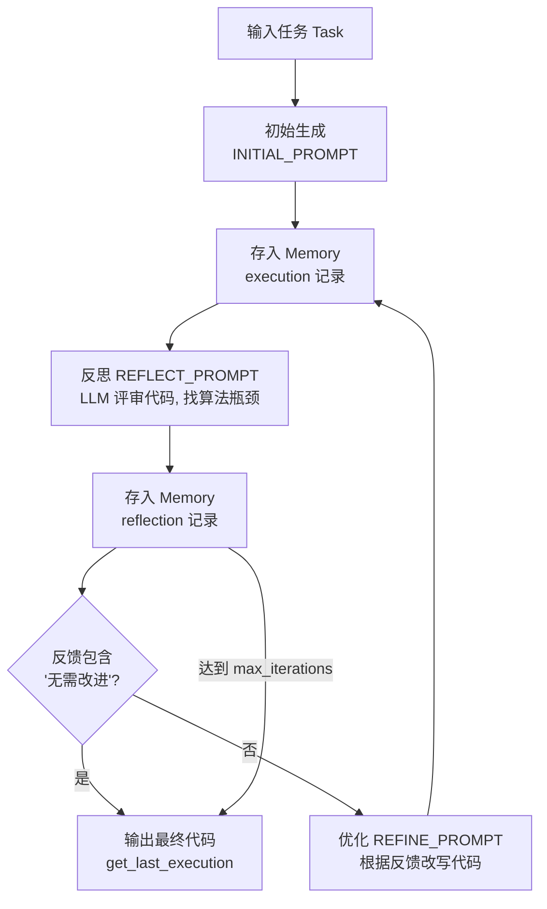

# 引言

本篇文章基于 `AgentLearning/paradigm` 目录下的代码实现，具体代码参照 [https://github.com/emberff/agentLearning](https://github.com/emberff/agentLearning)。
对目前主流的三种 Agent 范式进行整理与研究：

1. **ReAct**（Reason + Act）：推理与行动交替进行，动态调用外部工具。
2. **Plan-and-Solve**：先规划、后执行，将复杂任务拆解为有序子任务。
3. **Reflection**：生成 → 反思 → 改进，通过自我评审打磨单一产出物。

三者共享同一个 LLM 客户端封装，却体现了截然不同的决策逻辑，本文将从「核心思想、流程、关键代码、异同对比」四个维度逐一展开。

# 公共基础

三种范式都建立在同一个 LLM 客户端之上：

```python
# LLMCilent.py
class HelloAgentsLLM:
    def think(self, messages, temperature=0) -> str:
        # 调用任意兼容 OpenAI 接口的服务，默认流式响应
        response = self.client.chat.completions.create(
            model=self.model, messages=messages, stream=True)
        return "".join(chunk.choices[0].delta.content or "" for chunk in response)
```

统一的消息封装形式（均为单轮 user 消息）：

```python
messages = [{"roles": "user", "content": prompt}]
```

也就是说，三种范式本质上都是**「单智能体 + 多轮 LLM 调用」**，区别在于每一轮"喂给 LLM 什么、期望 LLM 输出什么、拿到输出后怎么处理"。

# 一、ReAct 范式

目录：`paradigm/react/`

## 核心思想

ReAct 将**推理（Reasoning）**与**行动（Acting）**交替进行：LLM 先思考（Thought），再决定行动（Action）——要么调用工具（`Tool[input]`），要么给出最终答案（`Finish[answer]`）。工具返回的观察结果（Observation）会回填到历史中，作为下一轮思考的依据，形成 **Thought → Action → Observation** 的循环。

## 流程



## 关键代码

提示词模板约束输出格式：

```python
REACT_PROMPT_TEMPLATE = """
可用工具如下:
{tools}

请严格按照以下格式进行回应:
Thought: 你的思考过程，用于分析问题、拆解任务和规划下一步行动。
Action: 你决定采取的行动，必须是以下格式之一:
- `{{tool_name}}[{{tool_input}}]`: 调用一个可用工具。
- `Finish[最终答案]`: 当你认为已经获得最终答案时。

Question: {question}
History: {history}
"""
```

核心循环（`reActAgent.py`）：

```python
while current_step < self.max_steps:
    current_step += 1
    tools_desc = self.tool_executor.getAvailableTools()
    history_str = "\n".join(self.history)

    prompt = REACT_PROMPT_TEMPLATE.format(tools=tools_desc, question=question, history=history_str)
    response = self.llm_client.think([{"roles": "user", "content": prompt}])

    thought, action = self._parse_output(response)          # 正则提取 Thought / Action

    if action.startswith("Finish"):                          # Finish[最终答案]
        return re.match(r"Finish\[(.*)\]", action, re.DOTALL).group(1)

    tool_name, tool_input = self._parse_action(action)       # Tool[input]
    success, observation = self.tool_executor.execute(tool_name, tool_input)

    # 错误恢复：连续 2 次调用同一失败工具 → 提示换工具；累计失败 3 次 → 提示重想；5 次 → 终止
    if not success:
        self.failed_count += 1
        ...

    self.history.append(f"Action: {action}")
    self.history.append(f"Observation: {observation}")       # 观察回填，进入下一轮
```

工具统一通过 `ToolExecutor` 注册与执行，返回 `(success, observation)` 二元组：

```python
class ToolExecutor:
    def registerTool(self, name, description, func): ...
    def execute(self, tool_name, tool_input):
        tool = self.tools.get(tool_name)
        if tool is None:
            return False, f"工具 '{tool_name}' 不存在。"
        try:
            result = tool["func"](tool_input)
            return True, result
        except Exception as e:
            return False, f"工具 '{tool_name}' 执行失败：{str(e)}"
```

本项目提供了两个工具：基于 SymPy 的 `calculator`（数学计算）与基于 Tavily 的 `search`（网页搜索）。

## 设计要点

- **决策粒度最细**：每一步都根据最新观察重新决策，路径自适应。
- **与环境交互**：反馈来自真实工具的执行结果（Observation）。
- **完善的容错机制**：针对"工具不存在、无有效返回、执行异常、连续失败"都有提示词层面的纠正引导。

# 二、Plan-and-Solve 范式

目录：`paradigm/planAndSolve/`

## 核心思想

将 Agent 拆分为 **Planner（规划器）** 与 **Executor（执行器）** 两个角色：Planner 一次性把问题分解为有序步骤列表，Executor 再严格按照计划逐步执行，每步结果累积为历史供后续步骤参考。规划与执行彻底分离——执行阶段不再回头修改计划。

## 流程



## 关键代码

Planner 要求 LLM 输出 ```` ```python ["步骤1","步骤2",...] ```` 的格式，再通过 `ast.literal_eval` 安全解析：

```python
class Planner:
    def plan(self, question: str) -> list[str]:
        prompt = PLANNER_PROMPT_TEMPLATE.format(question=question)
        response_text = self.LLMCilent.think([{"roles": "user", "content": prompt}])

        plan_str = response_text.split("```python")[1].split("```")[0].strip()
        plan = ast.literal_eval(plan_str)      # 安全地将字符串转为 Python 列表
        return plan if isinstance(plan, list) else []
```

Executor 逐步执行，历史持续累积：

```python
class Executor:
    def execute(self, question: str, plan: list[str]) -> str:
        history = ""
        for i, step in enumerate(plan):
            prompt = EXECUTOR_PROMPT_TEMPLATE.format(
                question=question, plan=plan,
                history=history if history else "无", current_step=step)

            response_text = self.LLMCilent.think([{"roles": "user", "content": prompt}])

            history += f"步骤 {i+1}: {step}\n结果: {response_text}\n\n"

        return response_text                   # 最后一步的回答即最终答案
```

编排层将两者串起来：

```python
class PlanAndSolveAgent:
    def run(self, question: str):
        plan = self.planner.plan(question)
        if not plan:
            return "无法生成有效的行动计划。"
        final_answer = self.executor.execute(question, plan)
```

## 设计要点

- **先总览后执行**：计划阶段俯瞰全局，避免走一步看一步的短视。
- **无外部工具**：本项目实现中执行阶段为纯 LLM 推理，不调用工具。
- **无反馈闭环**：步骤结果只作为上下文喂给下一步，失败不重试、计划不修正，鲁棒性弱于 ReAct。

# 三、Reflection 范式

目录：`paradigm/reflection/`

## 核心思想

面向**单一产出物的质量迭代**：先让 LLM 生成一版初始结果（代码），再由 LLM 扮演严格的评审专家给出反馈（Reflect），最后根据反馈改写优化（Refine）。整个过程用 `Memory` 记录 execution / reflection 两类轨迹，直到反思者认为"无需改进"或达到最大迭代次数。

## 流程



## 关键代码

三套提示词模板分别对应「生成 / 反思 / 优化」三个角色（程序员 / 评审专家 / 程序员）：

```python
INITIAL_PROMPT_TEMPLATE = "你是一位资深的Python程序员。请根据要求编写代码: {task}"
REFLECT_PROMPT_TEMPLATE = """
你是一位极其严格的代码评审专家... 请分析该代码的时间复杂度，
并思考是否存在一种算法上更优的解决方案...
如果代码在算法层面已经达到最优，才能回答'无需改进'。
"""
REFINE_PROMPT_TEMPLATE = """
请根据评审员的反馈，生成一个优化后的新版本代码。
# 你上一轮尝试的代码: {last_code_attempt}
# 评审员的反馈: {feedback}
"""
```

核心迭代循环（`reflectionAgent.py`）：

```python
def run(self, task: str):
    # 1. 初始执行
    initial_code = self._get_llm_response(INITIAL_PROMPT_TEMPLATE.format(task=task))
    self.memory.add_record("execution", initial_code)

    # 2. 迭代: 反思与优化
    for i in range(self.max_iterations):
        last_code = self.memory.get_last_execution()

        feedback = self._get_llm_response(REFLECT_PROMPT_TEMPLATE.format(task=task, code=last_code))
        self.memory.add_record("reflection", feedback)

        if "无需改进" in feedback:          # 反思者认为已最优 → 停止
            break

        refined_code = self._get_llm_response(
            REFINE_PROMPT_TEMPLATE.format(task=task, last_code_attempt=last_code, feedback=feedback))
        self.memory.add_record("execution", refined_code)

    return self.memory.get_last_execution()   # 取最近一次执行结果
```

Memory 是一个简单的短时记忆模块，区分两种记录类型：

```python
class Memory:
    def add_record(self, record_type, content):   # 'execution' 或 'reflection'
        self.records.append({"type": record_type, "content": content})

    def get_last_execution(self):
        for record in reversed(self.records):
            if record['type'] == 'execution':
                return record['content']
```

## 设计要点

- **反馈来自自我**：评审者与生成者同为 LLM，无外部环境介入。
- **以"质量收敛"为目标**：终止条件由反思者判定（"无需改进"），而非任务步骤完成。
- **适合打磨型任务**：代码生成、文章写作等需要迭代优化的场景。

# 三种范式的异同

## 相同点

1. **同一 LLM 客户端与消息封装**：均通过 `HelloAgentsLLM.think([{"roles": "user", "content": prompt}])` 调用，流式返回。
2. **多轮迭代的单一智能体结构**：没有多智能体协作，全靠同一模型反复调用推进任务。
3. **都维护一份历史/记忆**：ReAct 的 Action/Observation 列表、Plan-and-Solve 的步骤结果字符串、Reflection 的 Memory 记录。
4. **都有明确的终止条件**：ReAct 为 `Finish` 或 `max_steps`；Plan-and-Solve 为计划执行完毕；Reflection 为"无需改进"或 `max_iterations`。
5. **都依赖提示词约束输出格式**：Thought/Action 格式、```` ```python [...] ```` 列表格式、代码/反馈格式，并配套解析逻辑（正则 / `ast.literal_eval` / 直接取文本）。

## 不同点

| 维度 | ReAct | Plan-and-Solve | Reflection |
| --- | --- | --- | --- |
| 核心思想 | 推理与行动交替 | 先规划再执行 | 生成—反思—改进 |
| 决策时机 | 每步动态决策 | 计划一次性生成 | 迭代打磨同一产出 |
| 工具调用 | ✅ 动态调用（ToolExecutor） | ❌ 纯 LLM 推理 | ❌ 无外部环境 |
| 反馈来源 | 环境观察（工具结果） | 无闭环（结果仅作上下文） | 自我评审（LLM 自评） |
| 失败容错 | 强：同工具/累计失败计数 + 提示纠偏 | 弱：计划解析失败即终止 | 中：反思反馈决定是否继续 |
| 历史记录 | Action / Observation 交替 | 步骤与结果的顺序拼接 | execution / reflection 分类存储 |
| 终止条件 | Finish 动作 / 最大步数 | 计划步骤执行完毕 | "无需改进" / 最大迭代 |
| 擅长场景 | 需与外部世界交互（搜索、计算、调 API） | 长链路、可拆解的顺序任务 | 单一产物需要高质量（代码、写作） |

## 深入理解

- **ReAct 的"行动"导向**：它解决的痛点是**模型不知道外部世界发生了什么**，通过"想一步、做一步、看结果"把环境反馈引入推理闭环，是三种范式中唯一真正调用工具、也唯一具备错误恢复机制的。
- **Plan-and-Solve 的"全局"导向**：它解决的痛点是**单轮推理在长链路上会"走着走着丢了目标"**，因此先用一次全局规划锁定方向，再用独立步骤逐步逼近；代价是计划一旦生成就固定，灵活性最低。
- **Reflection 的"质量"导向**：它解决的痛点是**LLM 一次生成往往不够好**，通过"生成—评审—改写"的自我博弈逼近更优解；代价是多轮迭代的额外开销，且评审质量完全依赖模型自身水平。

三者的关系可以这样概括：**ReAct 决定"下一步做什么"，Plan-and-Solve 决定"一共做哪些事"，Reflection 决定"一件事怎么做更好"**。实际生产中的复杂 Agent 往往是将它们组合使用，例如用 Plan-and-Solve 制定计划、用 ReAct 执行单个步骤、再用 Reflection 对关键产出进行打磨。

# 总结

通过阅读 `paradigm` 目录的三个实现，可以看到：尽管三种范式共享同一套 LLM 调用基础，但各自面对的问题、设计取舍与适用场景完全不同。理解它们之间的异同，有助于在实际系统中按需组合，构建更鲁棒的 Agent 应用。

# 参考资料
[HelloAgents](https://github.com/datawhalechina/hello-agents)
