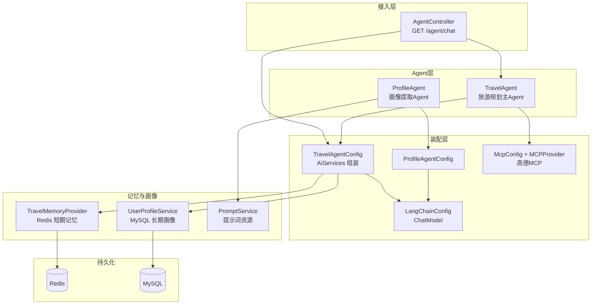
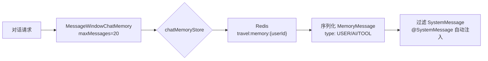
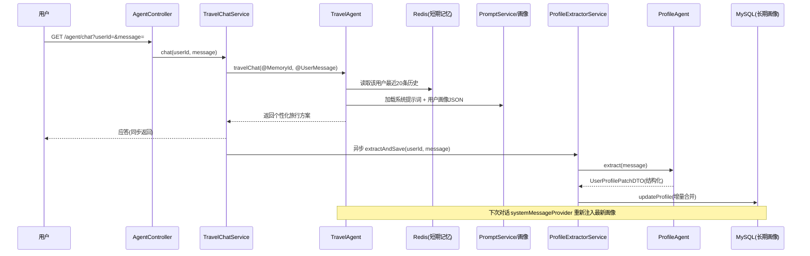

# 引言

本篇文章基于 `travel-agent` 项目，具体代码参照 [https://github.com/emberff/travel-agent](https://github.com/emberff/travel-agent)。

这是一个基于 **Spring Boot 3.2 + LangChain4j** 的旅游规划 Agent 应用：用户在对话框中提出旅游需求，Agent 结合**长期用户画像**与**短期对话记忆**生成个性化的旅行方案；同时在后台**异步提取用户画像**并持久化，让下一次对话更加"懂你"。

整个项目只有 8 次提交、约 30 个源码文件，但麻雀虽小五脏俱全——覆盖了 Agent 声明、结构化输出、短期记忆、长期画像、MCP 工具接入等完整链路。本文从 **Git 提交记录、实现组件、业务功能** 三个维度梳理并评估该项目。

# 技术栈与项目结构

## 技术栈

| 类别 | 技术 | 版本 | 用途 |
| --- | --- | --- | --- |
| 语言 | Java | 21 | 运行时 |
| 框架 | Spring Boot | 3.2.0 | Web 服务、依赖注入 |
| LLM 框架 | LangChain4j | 1.7.1 | Agent 声明、AiServices、ChatModel |
| 模型接入 | langchain4j-open-ai | 1.7.1 | OpenAI 兼容接口（baseUrl 可配） |
| 工具 | langchain4j-mcp | 1.7.1-beta14 | 高德 MCP 工具接入 |
| 记忆 | spring-boot-starter-data-redis | - | 短期对话记忆存储 |
| 持久化 | MyBatis-Plus + MySQL | 3.5.7 | 用户画像等长期数据 |
| 工具库 | Hutool / Jackson / Lombok | 5.8.27 | 工具、序列化、样板代码 |

## 目录结构

```
travel-agent
├── pom.xml
└── src/main
    ├── java/test
    │   ├── agent/planner      # TravelAgent / ProfileAgent 声明式接口
    │   ├── config             # ChatModel、Agent 装配、MCP、Redis
    │   ├── controller         # AgentController
    │   ├── dto / entity       # 画像 DTO / 持久化实体
    │   ├── listener           # ProfileAgent 响应监听器
    │   ├── mapper             # MyBatis-Plus Mapper
    │   ├── mcp                # MCP ToolProvider
    │   ├── memory             # Redis 短期记忆实现
    │   ├── service            # 编排、画像提取、提示词服务
    │   └── utils              # DTO → Entity 转换
    └── resources
        ├── prompts            # 提示词资源文件
        └── application*.yml
```

# Git 提交记录看项目演进

项目 2026-07-22 至 07-28 共 8 次提交，演进脉络非常清晰。其中 `e6813da`（修改 key 管理方式）仅调整 API Key 的配置方式，属于纯配置变更、不改变架构，故省略。整理如下：

| 阶段 | 提交 | 时间 | 核心内容 | 解决的问题 |
| --- | --- | --- | --- | --- |
| 1 | e0146ee / 58f13d5 | 07-22 | 项目初始化 + 基础 Agent 框架（TravelAgent 接口、ChatModel、测试接口） | 从零搭建，打通「接口 → LLM → 返回」最小链路 |
| 2 | 89215bb | 07-23 | 接入高德 MCP 工具，LLM 调用记录日志 | 让 Agent 具备获取真实地理位置等外部能力 |
| 3 | 153c33c | 07-24 | 提示词从注解改为 resource 资源文件；接入 Redis 短期记忆 | 提示词可维护；对话不再"失忆" |
| 4 | 9bb6b7f | 07-27 | 接入 MySQL + 项目结构调整（ProfileAgent、实体、画像服务） | 长期画像可持久化，引入第二个 Agent |
| 5 | 5a319c5 | 07-27 | ProfileAgent 输出监听器 + 完善 travel → profile 异步画像流程 | 画像提取融入主对话流程 |
| 6 | 345f721 | 07-28 | 用户画像注入 system prompt | 画像真正影响推荐，形成个性化闭环 |

可以看到演进顺序本身就是架构搭建的顺序：**最小框架 → 外部工具 → 短期记忆 → 长期画像 → 个性化闭环**。每个阶段都只解决一个问题，逐步把"一个能聊天的接口"演进成"一个有记忆、懂用户偏好的 Agent"。

# 整体架构



架构上呈明显的分层：**Controller（接入）→ Service（编排）→ Agent（AI 能力）→ 配置装配层（依赖注入）→ 记忆/持久化**。Agent 本身只是接口，真正的组装逻辑全部收敛在 Config 类中，业务代码与框架代码解耦得比较干净。

# 核心组件解析

## 双 Agent 设计

项目定义了两种 `AiService` 接口，一个管"对话与规划"，一个管"画像提取"：

```java
// agent/planner/TravelAgent.java —— 主Agent，带记忆
public interface TravelAgent {
    String travelChat(@MemoryId String userId, @UserMessage String userMessage);
}

// agent/planner/ProfileAgent.java —— 画像提取，结构化输出
public interface ProfileAgent {
    @SystemMessage(fromResource = "prompts/profile-extractor.txt")
    UserProfilePatchDTO extract(@UserMessage String message);
}
```

| 维度 | TravelAgent | ProfileAgent |
| --- | --- | --- |
| 职责 | 旅游规划与对话 | 从聊天中提取长期偏好 |
| 输入 | `@MemoryId userId` + 用户消息 | 用户消息 |
| 输出 | `String`（自然语言方案） | `UserProfilePatchDTO`（结构化 JSON） |
| 记忆 | MessageWindowChatMemory（Redis） | 无 |
| 系统提示词 | 动态注入（画像 JSON） | 静态 resource 文件 |
| 数据落库 | 间接（经画像链路） | 直接（异步保存画像） |

两个 Agent 用同一个 `ChatModel`，通过 `AiServices` 动态代理装配。`TravelAgentConfig` 是核心，它做了三件事：注入模型、绑定 Redis 记忆、**按用户动态拼接系统提示词**（把画像 JSON 注入 prompt）：

```java
// config/TravelAgentConfig.java —— AiServices 组装
return AiServices.builder(TravelAgent.class)
        .chatModel(chatModel)
        .chatMemoryProvider(memoryProvider)      // Redis 短期记忆
        .systemMessageProvider(userId -> {
            UserProfile profile = userProfileService.getByUserId(userId.toString());
            String profileJson = objectMapper.writeValueAsString(profile);
            String finalPrompt = "%s\n=====\n用户历史画像:\n%s"
                    .formatted(promptService.loadTravelPrompt(), profileJson);
            return finalPrompt;
        })
        .build();
```

## 记忆系统：Redis 短期记忆

短期记忆采用 LangChain4j 的 `MessageWindowChatMemory`，按 `userId` 隔离、保留最近 20 条，底层存储自定义实现 `RedisChatMemoryStore`：

```java
// memory/TravelMemoryProvider.java
return MessageWindowChatMemory.builder()
        .id(memoryId)                // 用户唯一ID
        .maxMessages(20)             // 保留最近20条
        .chatMemoryStore(store)      // Redis 存储
        .build();
```



序列化时做了一层**消息类型映射**，避免直接把 LangChain4j 的消息对象写进 Redis：

| 存储方向 | LangChain4j 消息 | Redis 中的形态 |
| --- | --- | --- |
| 写 | SystemMessage | 过滤，不保存 |
| 写 | UserMessage | `{type:"USER", content}` |
| 写 | AiMessage（含文本） | `{type:"AI", content}` |
| 写 | ToolExecutionResultMessage | `{type:"TOOL", content}` |
| 读 | `{type:"TOOL", content}` | 还原为 `SystemMessage`（见评估） |

## 画像系统：MySQL 长期画像

`UserProfile` 实体承载 8 个画像字段（预算、交通、偏好、目的地、风格、避雷、饮食、同行人）外加一个 `profileJson` 扩展字段。更新采用**增量合并**策略：无记录则插入，有记录则用 `BeanUtil.copyProperties` 忽略 null 字段做局部覆盖——这样每次提取只更新本次对话新发现的信息，不覆盖旧画像：

```java
// service/impl/UserProfileServiceImpl.java
if (old == null) {
    profile.setUserId(userId);
    save(profile);
    return;
}
BeanUtil.copyProperties(profile, old, CopyOptions.create().setIgnoreNullValue(true));
updateById(old);
```

## 提示词工程

`profile-extractor.txt` 是画像提取 Agent 的提示词，规则设计得比较严谨：

- **不猜测**：用户没说的信息不提取（"我要去西藏" ≠ 提取 travelStyle=自驾）
- **只存长期偏好**：一次性旅行计划不保存（"下个月去杭州"不提取目的地）
- **缺失字段置 null**：没有对应信息时必须输出 null
- **只返回 JSON**：输出格式被 `ProfileAgent` 直接反序列化为 `UserProfilePatchDTO`

## MCP 工具接入（高德）

`McpConfig` 通过高德的 Streamable HTTP MCP 端点建立客户端，`MCPProvider` 把它包装成 `ToolProvider`：

```java
// config/McpConfig.java
McpTransport transport = new StreamableHttpMcpTransport.Builder()
        .url("https://mcp.amap.com/mcp?key=" + amapKey)
        .build();
return new DefaultMcpClient.Builder().transport(transport).build();
```

值得注意：`TravelAgentConfig` 中 `toolProvider(mcpToolProvider)` 这一行目前被注释掉了，即**高德工具已接入、但未在装配时启用**（详见评估章节）。

# 关键业务流程



主链路是**同步对话**：`TravelChatService` 先调 TravelAgent 出方案，再**异步**（`@Async`，`@EnableAsync`）触发画像提取，两步互不阻塞；画像写入 MySQL 后，会在下一次对话时通过 `systemMessageProvider` 注入 prompt，形成"越聊越懂你"的闭环。

# 项目评估

## 设计亮点

1. **声明式 Agent**：业务只需写接口 + 注解，`AiServices` 动态代理生成实现，样板代码极少。
2. **记忆分层清晰**：Redis 管短期会话记忆（窗口 20 条），MySQL 管长期画像，各司其职。
3. **提示词资源外置**：系统提示词从注解硬编码改为 `resources/prompts/*.txt`，可独立迭代无需重新编译。
4. **结构化输出**：画像 Agent 直接产出 `UserProfilePatchDTO`，避免了"生成 JSON 再自己解析"的脆弱链路。
5. **异步解耦**：画像提取不影响主对话响应速度。

## 不足与改进建议

| 问题 | 影响 | 建议 |
| --- | --- | --- |
| 高德 MCP 工具已配置但未启用（`toolProvider` 被注释） | Agent 拿不到真实位置/天气/攻略，只能纯文本规划 | 启用装配，配置 amap key，按 prompt 中"必要时调用工具"执行 |
| `TravelPlan` / `ToolCallLog` / `ConversationRecord` 实体已建但未接线 | 生成的规划、工具调用、会话记录都不落库 | 接入 Service 持久化，沉淀数据 |
| `ProfileService` 与 `ProfileExtractorService` 职责重复，留有 TODO 注释 | 维护成本、双链路歧义 | 统一到异步链路，删除冗余实现 |
| `RedisChatMemoryStore` 读取时把 `TOOL` 消息还原为 `SystemMessage` | 工具结果被当成系统消息，历史语义错乱，影响多轮效果 | 恢复为 `ToolExecutionResultMessage`，或明确降级策略 |
| 无测试、无 README | 无法回归，他人难以上手 | 补充单元测试与使用文档 |
| 接口为 GET 同步返回 String | 长任务等待阻塞，体验差 | 改为 SSE / WebFlux 流式输出 |

# 总结

这个项目用最小的代码量演示了一条完整的 Agent 应用落地路径：**声明式 Agent + 短期记忆 + 长期画像 + 工具接入**。它最大的价值在于把 LangChain4j 的 `AiServices`、`ChatMemoryStore`、结构化输出、MCP 等能力串成了一条可运行的业务闭环——从"一个能聊天的接口"演进到"一个懂用户、能落库、可扩展的 Agent"。

如果要在生产中使用，重点是补上被注释的 MCP 工具、接通未落库的实体，并修正消息序列化的语义问题。

# 参考资料
- [LangChain4j](https://docs.langchain4j.dev/)
- [MyBatis-Plus](https://baomidou.com/)
- [高德开放平台 MCP](https://mcp.amap.com/)
