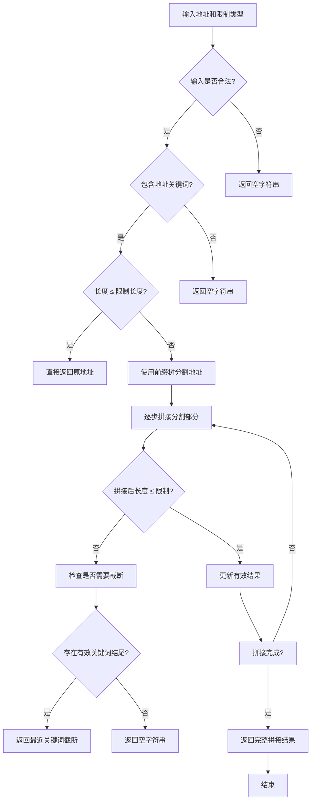

# 起因
这周在做项目的时候碰到一个问题: 要在项目的流程中接入阿里云SMS以及微信小程序订阅消息的发送功能, 而它们提供的发送接收参数里对于不同类型的参数长度是有限制的。`阿里云SMS` 接收位置参数最长为 **32个字符** , 而微信小程序根据模板的不同, 提供的接收参数最长长度也不同: `thing` 类型最多只能接收**20个字符**...
在最开始的开发版本, 和前端约定了依据地区编码, 将值通过接口发送给后端时在区和具体地址间以空格分隔, 后端再做简单处理: 通过空格分割字符串, 然后获取精确到区的文本。
然而现在前端改了获取精确地址的方式, 直接调用 `腾讯地图的api` 了! 所以后端不得不面临应该如何在有限的长度内尽量精确的长文本的问题。
恰好最近我看到前缀树的相关内容, 脑子一拍, 觉得这个数据结构相当符合我的需求, 索性直接做了一个工具类!
# 前缀树
前缀树（Trie，也叫字典树）是一种用于高效存储和查找字符串集合的数据结构，特别适用于**前缀匹配**的场景。
对于现在面对的问题本质, 实际上就是对一个长字符串的匹配关键字的问题, 因此除了使用前缀树, 还可以使用正则匹配的方式来解决。
##  使用前缀树 vs 使用正则匹配的对比	
|   | 使用前缀树 Trie | 使用正则表达式 |
|---|---|---|
| 性能 | 🔥 更高效（尤其是关键词多时） | ❗ 随关键词数量增加，性能下降 |
| 匹配方式 | 一次遍历字符流即可识别是否含有关键词（逐字符查字典） | 每次都需重新解释/编译正则，进行模式匹配 |
| 维护性 | 增删关键词仅修改关键词数组 | 修改正则表达式，易出错 |
| 扩展性 | 支持更复杂的匹配逻辑（比如词频统计、自动补全） | 只能简单匹配，难以扩展逻辑 |
| 可读性 | 代码逻辑清晰 | 正则语法复杂，可读性差 |
| 适合规模 | 关键词多（几十到上百）时效果显著 | 关键词少时比较方便快速 |

从性能角度考虑，前缀树在处理地址关键词的过滤时有显著优势，尤其是面对大量数据时。前缀树的查找时间复杂度是 O(n)，并且没有回溯问题，内存访问高效，适合用于大规模字符串匹配。而正则表达式在匹配时可能会遇到回溯问题，并且对于复杂模式的匹配开销较大，尤其在需要频繁检查多个字符串时性能较差。因此，使用前缀树作为过滤工具能显著提高效率，避免了正则表达式可能带来的性能瓶颈。
# 具体实现
## 流程图


## 代码
```java
import java.util.ArrayList;
import java.util.HashMap;
import java.util.List;
import java.util.Map;

/**
 * 基于前缀树的格式化地址工具类
 */
public class LocationFormatUtils {

    private static final TrieNode root = new TrieNode();

    // 省市区县等关键词
    private static final String[] LOCATION_KEYWORDS = {
            "自治区", "省", "市", "区", "县", "自治县", "街道", "镇", "乡", "路", "街", "巷", "号", "小区", "栋", "幢",
            "村", "组", "单元", "弄", "层", "室", "场", "大厦", "道", "屯", "里", "园", "圈"
    };

    static {
        // 预构建 Trie 树
        for (String keyword : LOCATION_KEYWORDS) {
            insertIntoTrie(keyword);
        }
    }

    /**
     * 获取最合适的格式化地址，使用指定限制类型
     */
    public static String getMostAccurateLocation(String location, LimitType type) {
        int maxLength = type.getLength();

        if (location == null || location.isEmpty()) {
            return "";
        }

        if (location.replaceAll("[^\\p{L}\\p{N}]", "").isEmpty()) {
            return "";
        }

        if (!containsLocationKeyword(location)) {
            return "";
        }

        if (location.length() <= maxLength) {
            return location;
        }

        List<String> partsList = splitByTrie(location);
        String[] parts = partsList.toArray(new String[0]);

        StringBuilder result = new StringBuilder();
        int currentLength = 0;
        String lastValid = "";

        for (String part : parts) {
            int partLength = part.length();
            if (currentLength + partLength <= maxLength) {
                result.append(part);
                currentLength += partLength;
                lastValid = result.toString();
            } else {
                break;
            }
        }

        return lastValid.isEmpty() ? truncateLocation(location, maxLength) : lastValid;
    }

    /**
     * 使用前缀树分割地址字符串
     */
    private static List<String> splitByTrie(String location) {
        List<Integer> splitPoints = new ArrayList<>();
        splitPoints.add(0);
        int currentIndex = 0;
        int length = location.length();
        while (currentIndex < length) {
            int maxLen = findLongestKeyword(location, currentIndex);
            if (maxLen > 0) {
                int splitPoint = currentIndex + maxLen;
                splitPoints.add(splitPoint);
                currentIndex = splitPoint;
            } else {
                currentIndex++;
            }
        }
        splitPoints.add(length); // 添加结束点

        List<String> parts = new ArrayList<>();
        for (int i = 1; i < splitPoints.size(); i++) {
            int start = splitPoints.get(i - 1);
            int end = splitPoints.get(i);
            if (start < end) {
                parts.add(location.substring(start, end));
            }
        }
        return parts;
    }

    /**
     * 寻找从指定位置开始的最长关键词
     */
    private static int findLongestKeyword(String s, int start) {
        int maxLen = 0;
        TrieNode node = root;
        for (int i = start; i < s.length(); i++) {
            char c = s.charAt(i);
            if (node.children.containsKey(c)) {
                node = node.children.get(c);
                if (node.isEnd) {
                    maxLen = i - start + 1;
                }
            } else {
                break;
            }
        }
        return maxLen;
    }

    /**
     * 判断字符串是否包含地址关键词
     */
    private static boolean containsLocationKeyword(String location) {
        TrieNode node = root;
        for (char c : location.toCharArray()) {
            if (node.children.containsKey(c)) {
                node = node.children.get(c);
                if (node.isEnd) {
                    return true;
                }
            }
        }
        return false;
    }

    /**
     * 截断地址至指定长度，并确保不截断关键字
     */
    private static String truncateLocation(String location, int maxLength) {
        String truncated = location.substring(0, maxLength);
        int lastValidIndex = -1;
        TrieNode node = root;
        int currentLength = 0;

        for (int i = 0; i < truncated.length(); i++) {
            char c = truncated.charAt(i);
            if (node.children.containsKey(c)) {
                node = node.children.get(c);
                currentLength++;
                if (node.isEnd) {
                    lastValidIndex = i + 1;
                }
            } else {
                // 重置到根节点，继续寻找可能的匹配
                node = root;
                currentLength = 0;
            }
        }

        return (lastValidIndex != -1) ? truncated.substring(0, lastValidIndex) : "";
    }

    /**
     * 在 Trie 树中插入关键词
     */
    private static void insertIntoTrie(String word) {
        TrieNode node = root;
        for (char c : word.toCharArray()) {
            node.children.putIfAbsent(c, new TrieNode());
            node = node.children.get(c);
        }
        node.isEnd = true;
    }

    /**
     * Trie 结构定义
     */
    static class TrieNode {
        Map<Character, TrieNode> children = new HashMap<>();
        boolean isEnd = false;
    }

    /**
     * 地址长度限制类型枚举
     */
    public enum LimitType {
        SMS(32, "SMS 地址长度"),
        SUBSCRIBE_MSG(20, "微信小程序订阅消息长度");

        private final int length;
        private final String desc;

        LimitType(int length, String desc) {
            this.length = length;
            this.desc = desc;
        }

        public int getLength() {
            return length;
        }

        public String getDesc() {
            return desc;
        }
    }

    public static void main(String[] args) {
        System.out.println(getMostAccurateLocation("北京市朝阳区望京街道阜安西路8号", LimitType.SMS));
        System.out.println(getMostAccurateLocation("北京市朝阳区望京街道阜安西路8号", LimitType.SUBSCRIBE_MSG));
        System.out.println(getMostAccurateLocation("无地址关键字文本描述信息仅作测试用途", LimitType.SMS));
        System.out.println(getMostAccurateLocation("###￥%@！@@#￥%……&*", LimitType.SUBSCRIBE_MSG));
    }
}
```
## 测试
### 测试类
```java
public class LocationFormatUtilsTest {

    @Test
    @DisplayName("测试直辖市地址")
    void testDirectControlledMunicipality() {
        assertEquals("北京市朝阳区望京街道阜安西路8号", LocationFormatUtils.getMostAccurateLocation("北京市朝阳区望京街道阜安西路8号", LocationFormatUtils.LimitType.SUBSCRIBE_MSG));
        assertEquals("上海市黄浦区南京东路299弄1号", LocationFormatUtils.getMostAccurateLocation("上海市黄浦区南京东路299弄1号", LocationFormatUtils.LimitType.SUBSCRIBE_MSG));
        assertEquals("重庆市渝中区解放碑八一路238号", LocationFormatUtils.getMostAccurateLocation("重庆市渝中区解放碑八一路238号", LocationFormatUtils.LimitType.SUBSCRIBE_MSG));
        assertEquals("天津市南开区卫津南路66号", LocationFormatUtils.getMostAccurateLocation("天津市南开区卫津南路66号", LocationFormatUtils.LimitType.SUBSCRIBE_MSG));
    }

    @Test
    @DisplayName("测试短地址（直接返回）")
    void testShortAddress() {
        assertEquals("深圳市南山区", LocationFormatUtils.getMostAccurateLocation("深圳市南山区", LocationFormatUtils.LimitType.SUBSCRIBE_MSG));
        assertEquals("成都市武侯区", LocationFormatUtils.getMostAccurateLocation("成都市武侯区", LocationFormatUtils.LimitType.SUBSCRIBE_MSG));
        assertEquals("杭州市西湖区", LocationFormatUtils.getMostAccurateLocation("杭州市西湖区", LocationFormatUtils.LimitType.SUBSCRIBE_MSG));
    }

    @Test
    @DisplayName("测试直辖市超长地址（截断）")
    void testDirectControlledMunicipalityLong() {
        assertEquals("北京市朝阳区望京街道阜安西路8号国际大厦", LocationFormatUtils.getMostAccurateLocation("北京市朝阳区望京街道阜安西路8号国际大厦A座12楼1208室", LocationFormatUtils.LimitType.SUBSCRIBE_MSG));
        assertEquals("上海市黄浦区南京东路299弄1号汇金大厦", LocationFormatUtils.getMostAccurateLocation("上海市黄浦区南京东路299弄1号汇金大厦27层2701室", LocationFormatUtils.LimitType.SUBSCRIBE_MSG));
        assertEquals("重庆市渝中区解放碑八一路238号", LocationFormatUtils.getMostAccurateLocation("重庆市渝中区解放碑八一路238号大都会广场写字楼A栋2208室", LocationFormatUtils.LimitType.SUBSCRIBE_MSG));
        assertEquals("天津市南开区卫津南路66号南开大学科技园", LocationFormatUtils.getMostAccurateLocation("天津市南开区卫津南路66号南开大学科技园创新大厦5层501室", LocationFormatUtils.LimitType.SUBSCRIBE_MSG));
    }

    @Test
    @DisplayName("测试自治区超长地址（截断）")
    void testAutonomousRegionLong() {
        assertEquals("广西壮族自治区南宁市青秀区民族大道", LocationFormatUtils.getMostAccurateLocation("广西壮族自治区南宁市青秀区民族大道166号航洋国际B座30楼3006室", LocationFormatUtils.LimitType.SUBSCRIBE_MSG));
        assertEquals("西藏自治区拉萨市城关区江苏东路36号", LocationFormatUtils.getMostAccurateLocation("西藏自治区拉萨市城关区江苏东路36号藏医学院教学楼A座302室", LocationFormatUtils.LimitType.SUBSCRIBE_MSG));
        assertEquals("新疆维吾尔自治区乌鲁木齐市天山区人民路", LocationFormatUtils.getMostAccurateLocation("新疆维吾尔自治区乌鲁木齐市天山区人民路88号国际商贸中心7层703室", LocationFormatUtils.LimitType.SUBSCRIBE_MSG));
        assertEquals("内蒙古自治区呼和浩特市赛罕区新华东街", LocationFormatUtils.getMostAccurateLocation("内蒙古自治区呼和浩特市赛罕区新华东街89号世贸广场5栋21楼2102室", LocationFormatUtils.LimitType.SUBSCRIBE_MSG));
        assertEquals("宁夏回族自治区银川市兴庆区解放西街29号", LocationFormatUtils.getMostAccurateLocation("宁夏回族自治区银川市兴庆区解放西街29号银川国际大厦22楼2201室", LocationFormatUtils.LimitType.SUBSCRIBE_MSG));
    }

    @Test
    @DisplayName("测试特别行政区超长地址（截断）")
    void testSpecialAdministrativeRegionLong() {
        assertEquals("香港特别行政区中西区中环皇后大道", LocationFormatUtils.getMostAccurateLocation("香港特别行政区中西区中环皇后大道中101号国际金融中心二期56层5608室", LocationFormatUtils.LimitType.SUBSCRIBE_MSG));
        assertEquals("澳门特别行政区花地玛堂区友谊大马路", LocationFormatUtils.getMostAccurateLocation("澳门特别行政区花地玛堂区友谊大马路399号南湾广场3楼301室", LocationFormatUtils.LimitType.SUBSCRIBE_MSG));
    }

    @Test
    @DisplayName("测试一般超长地址（截断）")
    void testLongGeneralAddress() {
        assertEquals("浙江省杭州市西湖区文二西路华星时代广场", LocationFormatUtils.getMostAccurateLocation("浙江省杭州市西湖区文二西路华星时代广场A座12楼1209室", LocationFormatUtils.LimitType.SUBSCRIBE_MSG));
        assertEquals("广东省广州市天河区天河北路233号", LocationFormatUtils.getMostAccurateLocation("广东省广州市天河区天河北路233号天汇大厦25楼2502室", LocationFormatUtils.LimitType.SUBSCRIBE_MSG));
        assertEquals("四川省成都市锦江区春熙路太古里南里商圈", LocationFormatUtils.getMostAccurateLocation("四川省成都市锦江区春熙路太古里南里商圈A栋18层1803室", LocationFormatUtils.LimitType.SUBSCRIBE_MSG));
    }

    @Test
    @DisplayName("测试特殊字符 & 异常输入")
    void testSpecialCases() {
        assertEquals("", LocationFormatUtils.getMostAccurateLocation("", LocationFormatUtils.LimitType.SUBSCRIBE_MSG)); // 空字符串
        assertEquals("", LocationFormatUtils.getMostAccurateLocation(null, LocationFormatUtils.LimitType.SUBSCRIBE_MSG)); // null
        assertEquals("", LocationFormatUtils.getMostAccurateLocation("12345678901234567890", LocationFormatUtils.LimitType.SUBSCRIBE_MSG)); // 无关键词
        assertEquals("", LocationFormatUtils.getMostAccurateLocation("无地址关键字文本描述信息仅作测试用途", LocationFormatUtils.LimitType.SUBSCRIBE_MSG)); // 无地址关键字
        assertEquals("", LocationFormatUtils.getMostAccurateLocation("###￥%@！@@#￥%……&*", LocationFormatUtils.LimitType.SUBSCRIBE_MSG)); // 特殊字符
    }
}
```
### 结果
