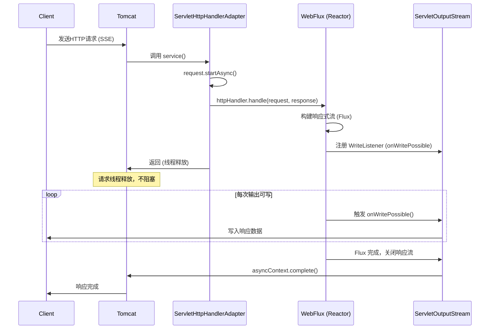

## 了解契机
最近在做B2C项目的时候碰到一个场景: 在订单某一流程下, 需要顾客对商家出示二维码, 然后商家扫码以调用后端提供的接口修改订单状态以推进服务流程的进行。

现在的问题是: 修改订单的接口是由商家调用的, 那么商家端可以由接口的 `resp` 很容易地知道订单状态改变是否成功, 而顾客端仅仅是出示了一个二维码, 它该如何从服务端知道订单的状态是否被改变成功, 可以进行服务流程的下一步了呢?

## Spring 框架下服务端主动推送消息的技术
据我在网上调研, 得到的方式有以下几种: 
1. `WebSocket`: 支持双向通信, 全双工、低延迟
2. `SSE（Server-Sent Events）`: 基于 `HTTP`, 由服务端单向向客户端发送信息
3. `短轮询`: 客户端基于一定时间间隔反复调用接口
4. `长轮询`: 客户端发出请求，服务器“挂起”请求直到有数据再响应

短轮询和长轮询肯定不考虑, 下面主要考虑 `WebSocket` 与 `SSE` 的优缺点:
- `WebSocket` 是支持双向通信的, 实时性强、适合频繁交互 (如聊天、协作、游戏), 但实现起来稍微有点复杂, 因为需要管理连接(如心跳管理), 且对于用户鉴权部分需要重新编写(`WebSocket` 由 `HTTP` 升级而来, 因而需要对请求头等部分重新处理)
- `SSE` 只支持服务端向客户端的单向推送消息, 但实现较为简单(`Servlet`原生支持) 且其本身是基于 `HTTP` 的连接, 可以在原有的鉴权基础上直接使用

## SSE 的使用
`spring-boot-starter-web` 依赖, `Servlet` 对 `SSE` 直接支持
### 编写
引入依赖:
```xml
        <dependency>
            <groupId>org.springframework.boot</groupId>
            <artifactId>spring-boot-starter-web</artifactId>
        </dependency>
```
### 具体编写
编写测试接口需要注意以下几个方面:
- 返回的类必须是 `SseEmitter`, 不可以再用其他包装类包装返回 
- `Thread.sleep(10000)` 表示返回数据的事件间隔
- 在 `SseEmitter.event().data()` 中的是需要返回的对象  
```java
@RestController
public class ServletSseController {
    @GetMapping("/sse-blocking")
    public SseEmitter ServletSse() {
        SseEmitter emitter = new SseEmitter();
    
        new Thread(() -> {
            try {
                while (!Thread.currentThread().isInterrupted()) {
                    Thread.sleep(10000);
                    emitter.send(SseEmitter.event().data("Data"));
                }
            } catch (Exception e) {
                emitter.completeWithError(e);
            }
        }).start();
        return emitter;
    }
}
```
### 测试接口返回

至此, 一个 `SSE` 的接口就完成了接下来是对性能方面的探究

## 接口性能
`Servlet` 下的 `SSE` 接口是 **阻塞式** 的, 这就意味着在高并发下它很容易触发 **OOM**, 因为 `Servlet` 本身的同步模式[^1]。 直到3.0版本开始才引入了异步机制!
在实际开发过程中, 向上面编写的每次直接 new 一个线程显然是不合适的, 按照一般方式引入线程池, 设置主要参数: `CorePoolSize`, `MaxPoolSize`, `QueueCapacity`, `RejectedExecutionHandler`等, 由此引发的问题是: 在这个线程池提供的线程数量固定, 而接口又是阻塞式的情况下, 并发量貌似低的有点离谱... 
使用 `ThreadPoolExecutor.CallerRunsPolicy()`(提交任务的线程（也就是调用 execute() 的线程）自己来执行这个任务) 的拒绝策略会让被拒绝的任务由容器 `tomcat` 的工作线程执行...这是不能接受的! 由此, 设想使用异步的框架 `WebFlux`

## WebFlux 实现 SSE 接口
`Spring WebFlux` 是 `Spring Framework 5.0` 中引入的新的响应式web框架。与Spring MVC不同，它不需要Servlet API，是**完全异步且非阻塞**的，并且通过Reactor项目实现了Reactive Streams规范[^2]。使用也很简单
依赖:
```xml
        <dependency>
            <groupId>org.springframework.boot</groupId>
            <artifactId>spring-boot-starter-webflux</artifactId>
        </dependency>
```
编写接口:
```java
@RestController
public class WebFluxSseController {
    @GetMapping(path = "/sse", produces = MediaType.TEXT_EVENT_STREAM_VALUE)
    public Flux<ServerSentEvent<String>> streamEvents() {
        // 模拟耗时操作（在独立线程中执行，不阻塞反应器线程）
        CompletableFuture.runAsync(() -> {
            try {
                Thread.sleep(5000); // 此睡眠发生在后台线程，不影响反应器线程
            } catch (InterruptedException e) {
                e.printStackTrace();
            }
        });

        // 异步发送事件（基于 Reactor 调度，非阻塞）
        return Flux.interval(Duration.ofSeconds(1))
                .map(seq -> ServerSentEvent.<String>builder()
                        .data("Event " + seq)
                        .build());
    }
}
```
接口测试:


## 接口对比
基于servlet的sse接口
```java
    @GetMapping("/sse-blocking-real") // SSE阻塞式验证
    public SseEmitter realBlockingSse() {
        SseEmitter emitter = new SseEmitter();
        try {
            // **不创建新线程，直接在 Tomcat 工作线程中循环发送数据**
            for (int i = 0; i < 10; i++) {
                Thread.sleep(500); // 阻塞 Tomcat 工作线程
                emitter.send(SseEmitter.event().data("Data"));
            }
        } catch (Exception e) {
            emitter.completeWithError(e);
        }
        return emitter; // 只有循环结束后，Tomcat 线程才会返回
    }
```
基于webflux的sse接口
```java
    @GetMapping(path = "/sse", produces = MediaType.TEXT_EVENT_STREAM_VALUE)
    public Flux<ServerSentEvent<String>> streamEvents() {
        return Flux.interval(Duration.ofSeconds(1))
                .delaySubscription(Duration.ofSeconds(5)) // 模拟延迟启动
                .map(seq -> ServerSentEvent.<String>builder()
                        .data("Event " + seq)
                        .build());
    }
```
测试接口
```java
    @GetMapping("/test")
    public String test() {
        // 记录处理线程名称（验证是否为反应器线程）
        System.out.println("Test handled by thread: " + Thread.currentThread().getName());
        return "Test response";
    }
```
在 `application.properties`中限制Tomcat进程数量:
```
server.tomcat.threads.max=2
```

阻塞式sse的测试类
```java
@SpringBootApplication
public class ServletSeeTest {

    public static void main(String[] args) {
        SpringApplication.run(ServletSeeTest.class, args);
        RestTemplate restTemplate = new RestTemplate();

        // 发起 3 个并发 SSE 请求（超过 Tomcat 线程池大小 2）
        for (int i = 0; i < 3; i++) {
            int finalI = i;
            new Thread(() -> {
                try {
                    long start = System.currentTimeMillis();
                    restTemplate.getForEntity("http://localhost:8080/sse-blocking-real", String.class);
                    long end = System.currentTimeMillis();
                    System.out.println("SSE 请求 " + finalI + " 耗时：" + (end - start) + "ms");
                } catch (Exception e) {
                    e.printStackTrace();
                }
            }).start();
        }

        // 等待一段时间，让 SSE 请求阻塞 Tomcat 线程
        try {
            Thread.sleep(2000);
        } catch (InterruptedException e) {
            e.printStackTrace();
        }

        // 发起测试请求（此时 Tomcat 线程已被占满，测试请求会排队）
        long testStart = System.currentTimeMillis();
        String testResponse = restTemplate.getForObject("http://localhost:8080/test", String.class);
        long testEnd = System.currentTimeMillis();
        System.out.println("测试请求耗时：" + (testEnd - testStart) + "ms");
    }
}
```
结果:

异步非阻塞式SSE测试:
```java
@SpringBootApplication
public class WebFluxSseTest {

    private static final WebClient webClient = WebClient.create("http://localhost:8080");

    public static void main(String[] args) {
        SpringApplication.run(WebFluxSseTest.class, args);

        // 配置线程池模拟并发（10 个并发 SSE 请求 + 10 个并发测试请求）
        ExecutorService executor = Executors.newFixedThreadPool(20);

        // 发起 10 个并发 SSE 请求（长连接）
        for (int i = 0; i < 10; i++) {
            executor.submit(() -> {
                webClient.get()
                        .uri("/sse")
                        .accept(MediaType.TEXT_EVENT_STREAM)
                        .retrieve()
                        .bodyToFlux(ServerSentEvent.class)
                        .take(5) // 接收 5 个事件后取消，避免无限等待
                        .blockLast(Duration.ofSeconds(10)); // 超时控制
            });
        }

        // 发起 10 个并发测试请求（验证是否快速响应）
        for (int i = 0; i < 10; i++) {
            executor.submit(() -> {
                long start = System.currentTimeMillis();
                String response = webClient.get()
                        .uri("/test")
                        .retrieve()
                        .bodyToMono(String.class)
                        .block(); // 同步获取结果（仅用于测试）
                long duration = System.currentTimeMillis() - start;
                System.out.println("Test request耗时: " + duration + "ms, 响应: " + response);
            });
        }

        executor.shutdown();
    }
}
```

## 踩坑记录
1. 由于原本项目中使用的的是Tomcat9作为容器, 是支持同时在使用servlet的同时使用webflux框架的. servlet3.1及以上才支持异步, 并不是指`servlet api`的版本要在3.1以上, 而是容器`Tomcat`支持3.1及以上就行
2. 当`webflux`请求进入`Tomcat`时, 实际还是使用的`Servlet容器`入口, 只是不占用tomcat的工作线程。 
Tomcat传统上使用基于线程池的请求处理模型，而不是事件驱动的异步I/O模型。当请求标记为异步时（例如async-supported=true），Tomcat会将其分配到 **一个独立的线程池** 中处理。



[^1]: [Servlet特性研究之异步模式](https://www.cnblogs.com/chen943354/p/16598898.html)
[^2]: [Spring WebFlux 入门](https://www.cnblogs.com/cjsblog/p/12580518.html)