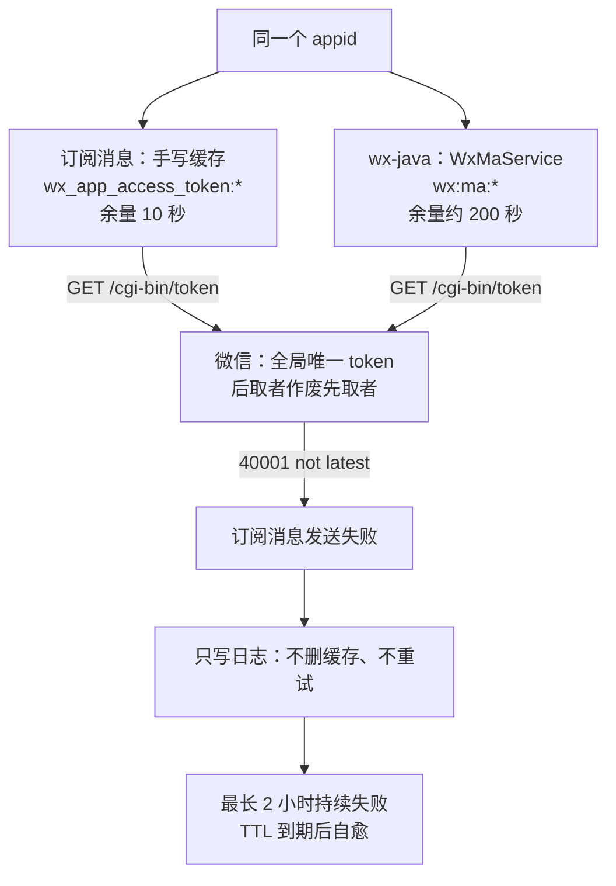


起因只是一句报错：**`invalid credential, access_token is invalid or not latest`**。顺着它挖下去，是一个"同一个 appid 有两套 token 缓存互相顶号"的经典结构问题；等代码改完、编译通过，准备跑自检时，又被第二个完全不相干的问题挡住——IDEA 里一排模块标着红色感叹号，日志写着 `Port 48081 was already in use`，可 `netstat` 里**根本没有任何进程监听那个端口**。

本文按 **起因 → 定位 → 解决 → 验证** 的顺序把两件事分别复盘，最后总结这两个坑的共同点：**它们都让错误信息指向了错误的方向，最后都靠一个对照实验把假设钉死。**


# 一、项目与环境

先说清环境，两个坑都跟它有关。

| 项目 | 值 |
| --- | --- |
| 后端 | Spring Cloud 多模块（yudao 架构），包名 `com.photography.hopai`，Spring Boot 2.7.16 |
| 注册/配置 | Nacos，Redis，Redisson，MySQL，Feign |
| 微信侧 | 小程序订阅消息（手写 HTTP 调用）+ wx-java 4.5.0（手机号授权、小程序码） |
| 模块端口 | gateway 48080、system 48081、infra 48082、bpm 48083、pay 48085、mp 48086、member 48087、product 48100 |
| 开发机 | Windows + WSL2（`.wslconfig` 里开着 `networkingMode=mirrored`），IDEA 在 Windows 侧跑服务 |

这两个前置事实，是后面两个坑各自的"地雷"：

1. 项目里**微信凭据是硬编码常量**，dev 和线上用同一对 appid/secret；
2. 开发机的 WSL **开着 mirrored 网络模式**，而 8 个模块的端口全部落在 48080–48100。

---

# 二、问题一：订阅消息"时好时坏"报 40001

## 2.1 现象与错误码语义

现象有三个特征，后来证明每一个都有用：

- 报错是 `40001 invalid credential, access_token is invalid or not latest`；
- 日志表里 **6 个不同的 `template_id` 都报同一个错**；
- 但**同一个模板也不是必错**——有时成、有时败。

先把错误码掰开看。微信的 `access_token` 是**全局唯一**的，有效期 7200 秒，**重复获取会让上一次获取的那份立即失效**（只有刷新瞬间有 5 分钟新老并存的窗口）。于是两个容易混淆的码含义完全不同：

| 错误码 | 字面含义 | 实际说明 |
| --- | --- | --- |
| `42001` | access_token expired | 你手里这份**单纯过期了** |
| `40001`（not latest） | 无效或**不是最新的** | 存在一份**比你更新、仍然有效**的 token，也就是"**有人在你之后又取了一次**" |

所以 `40001 not latest` 根本不是"需要换一个获取接口"的信号，而是"**这个 appid 有第二个地方在取 token**"的信号。报错文案里那句"could get access_token by getStableAccessToken"只是微信的通用建议，不是诊断结论——这一点差点把我带偏。

## 2.2 定位：先找到第二个取 token 的地方

按这个思路去仓库里搜所有取 token 的路径，很快就撞上了两套：

**① 订阅消息自己手写了一套缓存**（`SubscribeMsgSendServiceImpl`）：

```java
private String getAccessToken(Integer userType) {
    String redisKey = getRedisKey(userType);          // wx_app_access_token:member / :photographer
    Object cachedToken = stringRedisTemplate.opsForValue().get(redisKey);
    if (cachedToken != null) return cachedToken.toString();

    // pingpp 的 WxpubOAuth → GET /cgi-bin/token（普通版凭据）
    WxpubOAuth.AccessTokenResult response = WxpubOAuth.getAccessToken(getAppid(userType), getAppSecret(userType));
    stringRedisTemplate.opsForValue().set(redisKey, accessToken, expiresIn - 10, TimeUnit.SECONDS);
    return accessToken;
}
```

appid/secret 是**硬编码常量**；缓存 TTL 只留 **10 秒**余量（7190 秒）。

**② wx-java 也在为同一个 appid 取 token**（`SocialClientServiceImpl`）：它用 `WxMaRedisBetterConfigImpl` + `RedisTemplateWxRedisOps` 管理 `WxMaService`，内部同样调 `/cgi-bin/token`，但存在**另一套 Redis key**（`wx:ma:*`）。而它的触发点全是日常高频操作：

- 小程序登录拿手机号 → `getWxMaPhoneNumberInfo` → 需要 token；
- 生成小程序码 → `getUnlimitedQRCode` → 需要 token。

appid/secret 虽然来自 `system_social_client` 表，但**就是同一对**。

## 2.3 根因：两套 token 管理器，互相顶号

两套逻辑各自判定"我的缓存过期了"就自己调一次 `/cgi-bin/token`，而微信的规则是**后取的作废先取的**。两边余量不同（一个 7190 秒、一个 200 秒级），刷新时刻必然错开，于是**任一方刷新，另一方手上那份立刻作废**。



最致命的一环在失败处理上：

```java
Integer errcode = (Integer) responseMap.get("errcode");
subscribeMsgLogService.updateSubscribeMsgLog(message.getLogId(), errcode, errmsg);
// 然后就没有然后了：既不清缓存，也不重试
```

配合 7190 秒的 TTL，就得到现象里最关键的那个形状：**一次顶号 = 后续最长约 2 小时的所有订阅消息全部 40001**，等它自己的 key 过期后重新取 token 又"自愈"，如此循环。这就是"同一模板有时成有时败"。

## 2.4 为什么"时好时坏"：三个时间窗口

同一个根因，在三个不同时间尺度上表现出来：

| 窗口 | 尺度 | 机制 | 现象 |
| --- | --- | --- | --- |
| A 双管理器互顶 | 小时级（主因） | 两套缓存余量不同 → 刷新时刻错开 → 互顶，且失败不自愈 | 约 115 分钟的**连续爆发段** |
| B 并发击穿 | 毫秒级 | 延时队列用 `ThreadPoolExecutor(3, 5)` 并发跑 handler，多条提醒同时到期 → 同时 cache miss → 同时打 `/cgi-bin/token`；**后写入 Redis 的可能正是先取到、已作废的那个** | 同一分钟内**成败交错**，且 Redis 被写脏 |
| C 环境互顶 | 触发式 | appid/secret 硬编码，dev 和线上连各自 Redis 却用同一对凭据。本地做一次手机号授权或生成一次小程序码，**线上那份立刻作废** | "本地一跑，线上就挂" |

窗口 A 解释了"为什么时长约 2 小时"；窗口 B 解释了"为什么同一批里部分成功部分失败"；窗口 C 很可能就是"接入消息提醒之后才开始报错"的直接原因。

顺带一提，`SubscribeMsgProducer` 名字里有 MQ，实际是**同步直调**，`SubscribeMsgSendConsumer` 是死代码——本该由 MQ 提供的限流能力也不存在了。

## 2.5 修复方案：换稳定版凭据，而不是加锁

第一直觉是"给取 token 加分布式锁"。但官方文档给了更省事的路：`getStableAccessToken`（`POST /cgi-bin/stable_token`）。

| 官方特性 | 消掉的问题 |
| --- | --- |
| 与 `getAccessToken` 取得的凭据**完全隔离、互不影响** | 窗口 A：wx-java 再怎么刷也顶不掉它 |
| 普通模式下**有效期内重复调用返回同一个 token**（幂等） | 窗口 B：并发击穿不再产生"作废 token 写进 Redis"，**不需要分布式锁** |
| 同上（幂等） | 窗口 C：dev 和线上普通模式拿到同一个 token，不再互顶 |

代价是零架构改动：**不动 wx-java、不动参数格式、不波及其他 20 多处调用方**，而 `RestTemplate` 在类里本来就已经注入了。

## 2.6 改动清单（2 个文件，4 处）

**改动 1｜核心：换稳定版接口 + 边界防护**

```java
Map<String, String> requestBody = new HashMap<>();
requestBody.put("grant_type", "client_credential");
requestBody.put("appid", getAppid(userType));
requestBody.put("secret", getAppSecret(userType));
Map response = restTemplate.postForEntity(STABLE_TOKEN_URL, requestBody, Map.class).getBody();

Object accessToken = response == null ? null : response.get("access_token");
Object expiresIn  = response == null ? null : response.get("expires_in");
// 失败时不会返回这两个字段，必须拦掉，否则会把 null / 负 TTL 写进缓存
if (accessToken == null || !(expiresIn instanceof Number)) {
    throw new IllegalStateException("获取微信 access_token 失败：" + response);
}

long ttl = Math.max(((Number) expiresIn).longValue() - 300L, 60L);
stringRedisTemplate.opsForValue().set(redisKey, accessToken.toString(), ttl, TimeUnit.SECONDS);
```

两个细节都不是可有可无的防御：

1. **`Math.max(..., 60)` 必需**。稳定版在"返回已有 token"时，`expires_in` 是**剩余**有效期（官方示例是 345），直接 `-300` 会得到负数，`set(key, token, -X, SECONDS)` 直接抛异常。
2. **失败响应必须拦住**。这是原来就埋着的雷：凭据出错（40164 IP 白名单、40125 secret 失效）时响应里没有 `access_token`/`expires_in`，旧代码会执行 `set(key, null, -10, SECONDS)`。

**改动 2｜加自愈重试**，让偶发顶号不再硬等 2 小时：

```java
Map response = doSend(message, getAccessToken(message.getUserType()));

// 40001 / 40014 / 42001：清掉本地缓存重取一次再试
if (isAccessTokenInvalid(response)) {
    stringRedisTemplate.delete(getRedisKey(message.getUserType()));
    response = doSend(message, getAccessToken(message.getUserType()));
}

Object rawErrcode = response == null ? null : response.get("errcode");
// 微信正常一定返回 errcode；响应异常时按 -1 记录，避免拆箱 NPE
Integer errcode = rawErrcode instanceof Number ? ((Number) rawErrcode).intValue() : -1;
```

**改动 3｜顺手修掉同一个 handler 里的复制粘贴 bug**（与 40001 无关，但会造成摄影师**收不到拍摄提醒**）：

```java
// 改前：改的是已经发过的顾客对象，发出去的是从未赋值的对象
customerSubscribeMsgReq.setUserId(order.getMemberId())
        .setUserType(UserTypeEnum.PHOTOGRAPHER.getValue()) ...
subscribeMsgApi.sendSingleSubscribeMsg(photographerSubscribeMsgReq);   // 全 null → 校验直接抛异常

// 改后
photographerSubscribeMsgReq.setUserId(order.getPhotographerId()) ...
```

**刻意没做**：把硬编码 secret 挪到 Nacos（是安全债，不是本次故障原因，挪配置会给修复引入额外失败面）；把假 MQ 改成真 MQ（只影响吞吐，不影响正确性）。

## 2.7 验证：让缓存 TTL 自己作证

三条自检，其中第一条就是"运行的到底是不是新代码"的铁证——**只有新代码会产生 `TTL=6899`，旧代码必然是 7190**：

| # | 验证项 | 方法 | 结果 |
| --- | --- | --- | --- |
| 1 | 运行的是新代码 | 查 Redis 缓存 TTL | ✅ `TTL = 6899`（= 7200 − 300 − 1），旧代码必然 7190 |
| 2 | 稳定版取 token 成功 | 摄影师侧真实发送 | ✅ `errcode = 0` / `ok`，消息真实投递 |
| 3 | 两个 appid 都通 | 顾客侧发送 | ✅ member appid 同样建成缓存（TTL 6900）；返回 43101 是"用户未订阅"，非凭据问题 |
| 4 | 300 秒余量 | Redis TTL | ✅ `6900 = 7200 − 300` |
| 5 | **40001 自愈重试** | 手动塞垃圾 token 后再发 | ✅ 垃圾值被清掉换成真 token（TTL 6882），发送 `errcode = 0` |

第 5 项是最关键的验证，而且是**自证性的**：发送前缓存里是 `garbage_token_for_test`（TTL = −1 永不过期，比实际更严苛），发送后变成 142 字符真 token。**没有重试逻辑的话，这条记录必然是 40001，且垃圾值会残留整个 TTL。**

历史日志也印证了前文的判断：同一用户的记录里，`40001` 和 `errcode = 0` 出现在**同一个模板**上，而 `43101`（user refuse to accept the msg）对应的是用户没订阅——前者是凭据问题，后者与代码无关。


**两个没做的事，说明白：**
一是"稳定版与普通版凭据互相隔离"这条，只有官方文档依据，**没有实证**——要实证就得去调一次普通版 `/cgi-bin/token`，而这有可能打掉线上仍在用普通版凭据的环境，风险不对等。
二是 `PhotographyRemindHandle` 没有真实触发（触发它会给真实顾客和摄影师发真实短信），只在"模板兼容 + 代码逻辑"层面复核过。


# 三、问题二：端口被占用，但全系统都找不到占用者

## 3.1 现象：红感叹号 + Port already in use

代码编译通过、准备跑自检，结果 IDEA 里一排模块标红（红色感叹号），控制台打印：

```text
Disconnected from the target VM, address: '127.0.0.1:54113', transport: 'socket'
```

`Disconnected from the target VM` 只是 IDEA 在说"JVM 退出了"，是**结果不是原因**。真正的原因在每个模块自己的日志里（`D:\IdeaProjects\hopai\logs\<模块>-error.log`）：

```text
APPLICATION FAILED TO START
Web server failed to start. Port 48081 was already in use.
```

| 模块 | 被占端口 | 报错时刻（同一天，至少三轮） |
| --- | --- | --- |
| bpm-server | 48083 | 14:53:47 / 14:54:33 / 14:56:17 |
| member-server | 48087 | 14:54:01 / 14:56:26 |
| pay-server | 48085 | 14:54:06 / 14:56:27 |
| product-server | 48100 | 14:54:07 / 14:56:26 |
| system-server | 48081 | 14:54:24 / 14:56:36 |


**以后遇到红色感叹号，第一个该看的不是 IDEA 控制台，而是 `logs/<模块>-error.log`。** 控制台刷得快，`Disconnected from the target VM` 这种噪音会把真正的 `APPLICATION FAILED TO START` 冲掉；而且这个日志文件里有完整的时刻序列，能直接看出"失败了几轮"。


## 3.2 第一次误判：以为是进程没退干净

第一轮排查的结论是"上一次启动的 JVM 没退干净"，依据也像是很充分：

- 机器上确实有 3 个 java 进程，其中一个是 `SystemServerApplication`（该模块的主类）；
- 它的启动时刻（14:56:05）和报错时刻（14:56:36）差 31 秒，正好是 Nacos + 数据源 + Redis + MyBatis 初始化的耗时；
- **但它根本没在监听 48081**——它的 socket 只有 JMX 端口、连到 IDEA 调试器的连接、和两条到 Nacos 的连接。

于是有了两个结论，一个对、一个错：

- ✅ **对**：JVM 绑定端口失败后**不会退出**。Nacos 客户端和 Redisson 起的是非守护线程，Tomcat 绑定失败 → context 关闭 → 主线程结束，但这些线程还撑着进程，于是留下一个"活着却没监听端口"的僵尸 JVM，IDEA 面板里状态糊成一团。
- ❌ **错**：它是**受害者，不是元凶**。

这里还有一个顺手记下的坑：清理进程时**必须限定进程名**，否则 PowerShell 自己的命令行里含有关键字，会把自己也匹配上：

```powershell
Get-CimInstance Win32_Process |
  Where-Object { $_.Name -eq 'java.exe' -and $_.CommandLine -like '*com.photography.hopai*Application*' } |
  ForEach-Object { "kill PID $($_.ProcessId)"; Stop-Process -Id $_.ProcessId -Force }
```

**不要**用"杀掉所有 java.exe"了事——那会连带干掉 IDEA 的 Maven 依赖解析服务（`RemoteMavenServer36`）和增量编译服务（`jps.cmdline.BuildMain`），然后你会看到一堆新的、更难懂的红色报错。

## 3.3 转折：一个从没用过的端口也是 BLOCKED

清完进程后，端口**本应该**空了。但 14:58:56 又出现一次 48081 冲突，而当时 `netstat` 里没有任何进程监听 48081。于是换了一个更硬的测法——**直接尝试绑定**：

```powershell
48080,48081,48082,48083,48085,48086,48087,48100 | % { $l=$null; try { $l=[Net.Sockets.TcpListener]::new([Net.IPAddress]::Any,$_); $l.Start(); "$_ OK" } catch { "$_ BLOCKED" } finally { if($l){$l.Stop()} } }
```

结果全 FAIL，错误是 `WSAEADDRINUSE`（10048），而 `netstat` 依然查不到任何监听者——**这两个事实直接矛盾**。

矛盾就意味着假设错了。于是做**对照实验**：把"从来没用过的端口"和"正常端口"一起测，区分是"这 8 个端口特殊"还是"测法有问题"。

| 端口 | 能否绑定 | 说明 |
| --- | --- | --- |
| 20000 / 30000 / 38000 / 40000 / 43000 / 43500 / 44000 / 44500 | ✅ OK | 保留段之外 |
| 44800 / 44900 / 45000 / 46000 / 47000 / 48000 / 48081 / **48084** / 48300 / 48500 / 48700 | ❌ **BLOCKED** | 全在这段里 |
| 48750 / 48777 / 49000 / 8080 / 18081 / 19000 | ✅ OK | 保留段之外 |

**决定性证据是 48084**：这个端口项目从来没用过，照样 BLOCKED。所以不可能是个别端口被进程占用，只能是**一整段端口被保留**——实测范围约 **44800 – 48718**，而 8 个模块的端口 48080–48100 **全部落在里面**。

## 3.4 根因：WSL2 mirrored 网络模式在主机侧保留了整段端口

逐一排除的过程：

| 排查项 | 结果 |
| --- | --- |
| `netstat -ano` 该段有无监听 | 无 |
| `Get-NetTCPConnection` / `Get-NetUDPEndpoint` | 无绑定 |
| `netsh interface ipv4 show excludedportrange protocol=tcp` | 只有 5357、9001、27339、50000–50059，**不含这段** |
| Docker Desktop（`com.docker.backend` / `vpnkit`） | **没在跑**，排除 |
| WSL2（`vmmemWSL`、`wslservice`、`vmcompute`） | **在跑** |
| `C:\Users\15222\.wslconfig` | `[wsl2]` 段里有 **`networkingMode=mirrored`** |


**保留段的确切归属者，我当时没能直接列出来**——`Get-HnsPolicyList` 需要管理员权限，返回 `E_ACCESSDENIED`。所以最终归因靠的是"**唯一变量 + 关掉后立即恢复**"的对照实验，而不是拿到归属者名单。WSL 社区已有同类反馈（[microsoft/WSL#40169](https://github.com/microsoft/WSL/issues/40169)，标题就是 "Mirrored Mode silently locks massive continuous ranges of localhost ports"），可以互相印证。


## 3.5 为什么这个坑这么难查：三个放大器

| # | 放大器 | 说明 |
| --- | --- | --- |
| 1 | **Spring Boot 的报错文案有误导性** | 绑定失败的错误码统一是 `WSAEADDRINUSE`（10048），Spring Boot 一律翻译为 `Port xxx was already in use`。但 10048 并不只代表"有人占着"，**主机侧保留同样触发它** |
| 2 | **JVM 失败后不退出** | Nacos / Redisson 的非守护线程撑着进程，留下"活着但没监听端口"的僵尸 JVM，看起来就像它占着端口 |
| 3 | **保留段是动态分配的** | Hyper-V / WSL 在启动时挑一段，**重启后会挪位置**。这解释了"以前好好的、今天突然全挂"，也意味着不修的话它会继续随机地好或坏 |

顺带一个验证顺序上的陷阱：**不要在 WSL 关着的时候测端口**。那时候端口当然是空的，是**假通过**。必须先把 WSL 重新跑起来，再在 Windows 侧测。

## 3.6 修复：先关掉 mirrored，保留可逆性

改 `C:\Users\15222\.wslconfig`，**用注释而不是删除**，把原因留在原地：

```ini
[wsl2]
# networkingMode=mirrored   # disabled 2026-09-29: mirrored 会在主机侧保留一整段 TCP 端口，导致 48080-48100 无法绑定
memory=4GB
processors=4
swap=8GB

[experimental]
autoMemoryReclaim=gradual
sparseVhd=true
```

然后 `wsl --shutdown` 让配置生效。


**这一步必须由人来做，工具做不了。** `.wslconfig` 只在 WSL2 虚拟机重启时读取，而 `wsl --shutdown` 会连带杀掉运行在 WSL 里的编辑会话**和编辑器服务本身**。同理，改完配置后 DSH 这类服务也**不会自启**（PID 1 是 `/init` 不是 systemd，没有任何自启单元），需要手动重新拉起。


备选方案按"改动面"排序：

| 方案 | 做法 | 代价 / 前提 |
| --- | --- | --- |
| **A. 关掉 mirrored（本次采用）** | 注释 `networkingMode=mirrored` + `wsl --shutdown` | 失去 mirrored 特性：Linux 侧访问 Windows 的 localhost、IPv6、部分 VPN 兼容性。**Windows → WSL 的 localhost 访问不受影响**（NAT 模式自带转发），所以本地服务照常访问 |
| **B. 保留 mirrored，排除指定端口** | `[experimental] ignoredPorts=48080,48081,...` + `wsl --shutdown` | 改动面最小，但需要**实测确认**对本机版本有效（本机 WSL 2.7.11.0） |
| **C. 管理员兜底** | 管理员 PowerShell：`net stop winnat` + `net start winnat` | 重置 Hyper-V 端口保留的经典手段，会短暂中断 Hyper-V / WSL 网络 |
| **D. 把端口挪出保留段** | 模块端口从 48xxx 挪到 38xxx（如 gateway 38080、system 38081…） | 改动面最大：8 个 `bootstrap.yaml` 的 `server.port`、Nacos 里的网关路由、`http-client.env.json`、各种写死端口的脚本 |

之所以选 A：它是**最省事、最确定**的一条，而且改一行、随时可以注释回去。如果当初开 mirrored 是为了解决某个具体问题，就应该选 B 而不是 A。

## 3.7 验证：端口全部恢复

关掉 mirrored 并重启 WSL、重新拉起服务之后：

| 验证项 | 结果 |
| --- | --- |
| 端口保留 | **彻底消失**：48082 / 48083 / 48085 / 48086 / 48100 全部可绑定；48080 / 48081 / 48087 是模块自己在用 |
| 运行中的模块 | gateway 48080、system 48081、member 48087 正常启动 |
| 副作用 | WSL 回到 NAT 模式，`127.0.0.1` 不再与 Windows 共享 → 测试请求改从 **Windows 侧**发（直接打 `127.0.0.1:48081`），之后的自检全部走通 |

`logs/*-error.log` 里那些 `Port already in use` 是**旧的**，别被误导——判断端口是否恢复，永远以"能不能绑定"的实测为准，而不是以日志的最后修改时间为准。

# 四、复盘：这两个坑的共同点

两件事表面上毫不相干，但走过的路几乎一模一样：

| | 问题一（40001） | 问题二（端口保留） |
| --- | --- | --- |
| 错误信息指向 | "换 getStableAccessToken" | "Port already in use" |
| 真实方向 | 找到**第二个**取 token 的地方 | 找到**保留端口段**的归属者 |
| 打破僵局的证据 | 同一模板"时好时坏" + 两个 Redis key 并存 | **48084 从没用过也 BLOCKED** |
| 根因结构 | 同一个资源有两个管理者 | 同一段端口有两个管理者（项目 vs WSL） |
| 修法 | 让 token 只有一个管理者（稳定版凭据，天然幂等） | 让端口只有一个管理者（关掉 mirrored / 挪端口） |
| 验证方式 | 缓存 TTL 数值自证（6899 vs 7190） | 绑定测试实测（OK / BLOCKED） |

能提炼出来的三条：

1. **错误码/报错文案是最不可信的证据**。`40001 not latest` 的文案在教你怎么换接口，`WSAEADDRINUSE` 的文案在教你去杀进程——两个方向都是错的。真正有用的是**形状**：时好时坏、跨模板、跨用户一致 → 凭据问题；全端口段、连没用过的端口也失败 → 整段保留。
2. **"两个事实互相矛盾"的时候，不要挑一个信，去做对照实验**。"netstat 没有监听者"和"绑不上端口"只能有一个是假的——补一个"从没用过的端口"作对照组，立刻分出真假。
3. **状态要能自己作证**。缓存 TTL 的数值本身就证明运行的是哪版代码，端口绑定测试本身就证明端口是否可用。凡是能用一个数值/一次绑定把结论钉死的，就不要靠"我觉得生效了"。

# 五、踩坑清单汇总

| # | 现象 | 根因 | 解决 |
| --- | --- | --- | --- |
| 1 | 订阅消息 `40001 not latest`，同模板时好时坏 | 同一 appid 有两套 token 缓存（手写 + wx-java）互相顶号 | 改用 `POST /cgi-bin/stable_token`（与普通版隔离且幂等） |
| 2 | 一次顶号后连续约 2 小时全部失败 | 收到 40001 只写日志，不删缓存不重试，而 TTL 留了 7190 秒 | 40001/40014/42001 时清缓存重试一次 |
| 3 | 稳定版返回已有 token 时 TTL 可能为负 | `expires_in` 此时是**剩余**有效期 | `Math.max(expires_in - 300, 60)` |
| 4 | 凭据出错时可能写入 null | 失败响应里没有 `access_token`/`expires_in` | 取不到字段直接抛异常，不写缓存 |
| 5 | 摄影师收不到拍摄提醒 | 复制粘贴 bug：改的是顾客对象，发的是全 null 的摄影师对象 | 改成 `photographerSubscribeMsgReq` + `getPhotographerId()` |
| 6 | IDEA 红感叹号 + `Disconnected from the target VM` | JVM 启动失败后退出了，这是结果不是原因 | 看 `logs/<模块>-error.log` |
| 7 | `Port already in use` 但 netstat 找不到占用者 | WSL2 mirrored 在主机侧保留约 44800–48718 整段 TCP 端口 | 注释 `networkingMode=mirrored` + `wsl --shutdown` |
| 8 | 失败的 JVM 不退出，看起来像它占着端口 | Nacos / Redisson 起的是非守护线程 | 别信 IDEA 面板；用 `Get-CimInstance Win32_Process` 按命令行精准清理 |
| 9 | PowerShell 清理把自己也杀了 | 命令行里含匹配关键字 | 条件里必须带 `$_.Name -eq 'java.exe'` |
| 10 | 关掉 WSL 后测端口"通过" | 那是假通过 | 先把 WSL 跑起来再测 |
| 11 | 备份文件内容和"备份前"不一致 | 备份和编辑在同一条消息里并发执行，顺序没保证 | 备份与编辑**串行**执行，且改完核对备份内容 |
| 12 | 命令行 Maven 全部构建失败 | 全局 `~/.m2/settings.xml` 第 15 行多了个 `</settings>`（IDEA 内部构建不受影响，一直没暴露） | 删掉多余结束标签 |
| 13 | WSL 里 `git push` 报 `could not read Username for 'https://gitee.com'` | WSL 那套 git 的 `~/.git-credentials` 里只有 github 条目 | 改用 Windows 侧那套 git（`git.exe -C ... push origin dev`），凭据在 Windows 凭据管理器里 |

# 六、遗留与后续

1. **硬编码的 appid/secret 应该挪到 Nacos**。本次没动，因为它是安全债、不是故障原因（稳定版幂等后环境互顶已消失），挪配置会给修复引入额外的失败面。但它同时意味着：**微信不认识 dev 和 prod，在 dev 环境测试发出去的就是真实用户的真实推送。**
2. **`ignoredPorts` 方案值得实测一遍**，如果还想用 mirrored 的话。
3. **"稳定版与普通版凭据互相隔离"仍未实证**，只有官方文档依据；要实证得付出可能打掉线上普通版凭据的成本，风险不对等。
4. **假 MQ（同步直调）+ 死掉的 Consumer** 仍然是技术债，只影响吞吐不影响正确性。
5. 历史上 `errcode = 40001` 的那批日志，可以考虑补发一次。

# 参考资料

- [微信官方文档 · access_token 使用说明](https://developers.weixin.qq.com/doc/oplatform/developers/dev/AccessToken.html)
- [微信官方文档 · 获取稳定版接口调用凭据 getStableAccessToken](https://developers.weixin.qq.com/doc/subscription/api/base/api_getstableaccesstoken.html)
- [微信官方文档 · 小程序订阅消息](https://developers.weixin.qq.com/miniprogram/dev/OpenApiDoc/mp-message-management/subscribe-message/sendMessage.html)
- [microsoft/WSL Issue #40169 · Mirrored Mode silently locks massive continuous ranges of localhost ports](https://github.com/microsoft/WSL/issues/40169)
- [Microsoft Learn · WSL 高级设置配置（.wslconfig）](https://learn.microsoft.com/windows/wsl/wsl-config)
- [Spring Boot 启动提示端口被占用但找不到占用进程（WSL mirrored 导致）](https://www.cnblogs.com/Higurashi-kagome/p/19804172)
