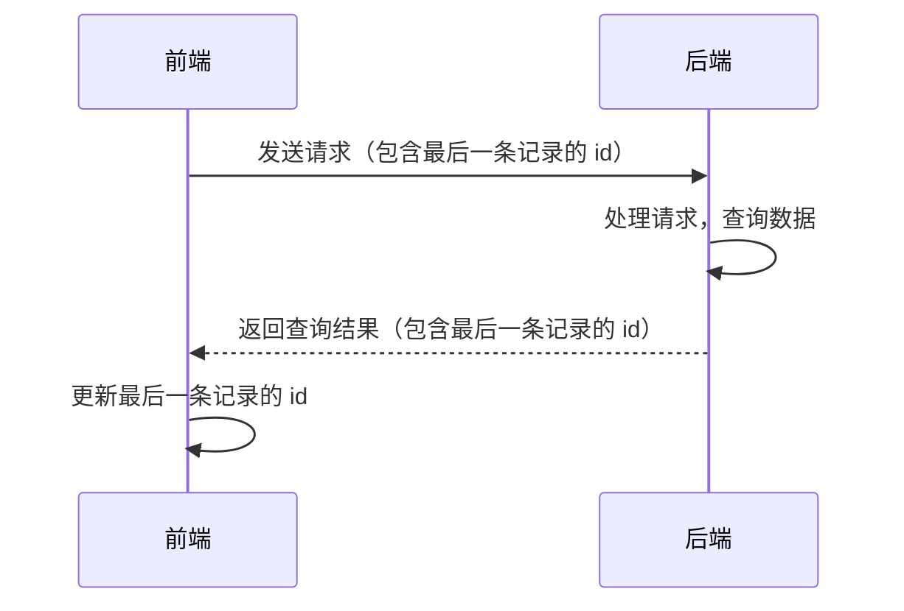


在[MallChat](https://github.com/zongzibinbin/MallChat) 项目过程中学习到的游标翻页方式

# 深翻页问题
在前端与后端的交互过程中, 当涉及翻页时, 一般的方式是前端将需要的分页页数 `pagerNo` 以及每页的记录条数 `pageSize` 发送给后端, 然后后端返回对应的记录。
例如, 当前端要查询 `pageNo` = 11, `pageSize` = 10 的记录时, 对应的 SQL 查询语句为:
```
select * from table limit 100,10
```
然而, 它的问题是虽然我们并不需要查询前面的100条记录, `MySQL` 在执行时仍会对前面的记录进行扫描, 然后再跳过那些记录。这里是一个可以优化的点。如果在 `SQL` 查询中使用了 `WHERE` 子句来限制结果集，并且在该限制字段上添加了索引，那么数据库可以更有效地检索所需的记录，而不需要扫描前面不需要的记录:
```
select * from table where id>100 order by id limit 10
```
在这个语句中, 如果在 `id` 字段上添加了索引, 那么 `MySQL` 就能直接定位到需要的记录并返回后面十条, 而不是做扫描前面100条记录然后再丢弃那样的无用功。这样效率会大大提升, 这就是以游标翻页的方式进行查询, 而 `id` 字段就是游标。

# 游标翻页
以游标翻页的方式进行查询, `id` 字段是最重要的, 它关乎数据库在查询记录时的定位, 因此前后端交互时发送的请求和返回的数据也要进行相应的修改: 

在使用游标翻页时, 需要注意:
- 数据库表中 `id` 必须 **单调**, 如果 `id` 不是单调的，可能会导致查询中出现跳页或记录缺失的问题。
  例子如下:假设有一张 `UserFriend` 表:

    | id  | name    |
    | --- | ------- | 
    | 101 |	Alice   |
    | 105 |	Bob     |
    | 103 |	Charlie | 
    | 104 |	David   |
    | 102 |	Eve     |
    
    ```
    // 第一次查询
    SELECT * FROM UserFriend WHERE id < 105 ORDER BY id DESC LIMIT 3;

    // 第二次查询
    SELECT * FROM UserFriend WHERE id < 102 ORDER BY id DESC LIMIT 3;

    ```
    在首次查询时以 `105` 为游标, 得到的结果是 `103`, `104`, `102`三条记录, 此时的游标变为 `102`。而在第二次查询时, 结果就是 `101` 了很明显出现了跳页的情况! 
    因此如果 `id` 使用 `UUID` 是不能使用游标翻页的方式的, 至于 `雪花算法生成id`, 在单节点下它是能保证单调递增的, 但在多实例中没法保证……(八股文吟唱开始!)
    有关雪花算法可以参考 [雪花算法 Snowflake 生成分布式自增 ID 详解](https://blog.csdn.net/fujuacm/article/details/108917165)

# 游标翻页的实现
首先定义前后端交互的 `reqVO` 以及 `respVO` :
`requsetVO`
```
@Data
@ApiModel("游标翻页请求")
@AllArgsConstructor
@NoArgsConstructor
public class CursorPageBaseReq {

    @ApiModelProperty("页面大小")
    @Min(0)
    @Max(100)
    private Integer pageSize = 10;

    @ApiModelProperty("游标（初始为null，后续请求附带上次翻页的游标）")
    private String cursor;

    public Page plusPage() {
        return new Page(1, this.pageSize, false);
    }

    /**
     * 多获取一条记录的方法
     * @return
     */
    public Page plusPageWithExtraRecord() {
        return new Page(1, this.pageSize + 1, false);
    }

    @JsonIgnore
    public Boolean isFirstPage() {
        return StringUtils.isEmpty(cursor);
    }
}
```
`responseVO`
```
@Data
@ApiModel("游标翻页返回")
@AllArgsConstructor
@NoArgsConstructor
public class CursorPageBaseResp<T> {

    @ApiModelProperty("游标（下次翻页带上这参数）")
    private String cursor;

    @ApiModelProperty("是否最后一页")
    private Boolean isLast = Boolean.FALSE;

    @ApiModelProperty("数据列表")
    private List<T> list;

    public static <T> CursorPageBaseResp<T> init(CursorPageBaseResp cursorPage, List<T> list) {
        CursorPageBaseResp<T> cursorPageBaseResp = new CursorPageBaseResp<T>();
        cursorPageBaseResp.setIsLast(cursorPage.getIsLast());
        cursorPageBaseResp.setList(list);
        cursorPageBaseResp.setCursor(cursorPage.getCursor());
        return cursorPageBaseResp;
    }

    @JsonIgnore
    public Boolean isEmpty() {
        return CollectionUtil.isEmpty(list);
    }

    public static <T> CursorPageBaseResp<T> empty() {
        CursorPageBaseResp<T> cursorPageBaseResp = new CursorPageBaseResp<T>();
        cursorPageBaseResp.setIsLast(true);
        cursorPageBaseResp.setList(new ArrayList<T>());
        return cursorPageBaseResp;
    }

}
```
在 `DAO` 层基于 `MybatisPlus` 对游标处理, 在这里要判断是否为最后一页有一个 `bug`, 那就是如果记录的总条目数是查询条数的总数倍的话, 并不能正确判断下一页是否为空。解决的方式是每次在查询时多查询一条记录, 如果最后一条为空那么当前页就是最后一页, 然后丢弃多查询的那条记录再返回前端。当然, 现在这样做如果判断错了, 要付出的代价也就是前端多请求一次罢了! 
```
    public CursorPageBaseResp<UserFriend> getFriendPage(Long uid, CursorPageBaseReq req) {
        LambdaQueryChainWrapper<UserFriend> wrapper = lambdaQuery();
        // 游标字段     倒序查询, 查询id比传来的游标小的记录
        wrapper.lt(UserFriend::getId, req.getCursor());
        // 游标方向
        wrapper.orderByDesc(UserFriend::getId);
        // 查询条件     此处为对应uid的好友
        wrapper.eq(UserFriend::getId, uid);
        // 游标翻页结果
        Page<UserFriend> page = page(req.plusPage(), wrapper);
        // 计算游标位置: 查询出的最后一条记录的id
        String cursor = Optional.ofNullable(CollectionUtil.getLast(page.getRecords()))
                .map(UserFriend::getId)
                .map(String::valueOf)
                .orElse(null);
        // 判断是否最后一页
        boolean isLast = page.getRecords().size() != req.getPageSize();
        return new CursorPageBaseResp<>(cursor, isLast, page.getRecords());
    }
```

# 对于游标翻页工具类的封装
在上面的代码中, 只有 `查询条件` 以及 `游标字段` 是常变的, 因此可以考虑将其他代码抽离成一个工具类。
入参：
`mapper`：`mybatisplus` 的数据库操作类，让工具类能调用一些基础的查询方法。
`pageBaseReq`：就是前端给的对象，里面的字段是 `cursor` 和 `size`
`wrapperComsumer`：提供的扩展点，业务方可以在 `sql` 中拼接一些查询条件。比如只查状态正常的
`cursorColumn`：游标字段，用于游标查询，以及后续的游标计算。
```
public class CursorUtils {
    public static <T> CursorPageBaseResp<T> getCursorPageByMysql(IService<T> mapper, CursorPageBaseReq request, Consumer<LambdaQueryWrapper<T>> initWrapper, SFunction<T, ?> cursorColumn) {
        //游标字段类型
        Class<?> cursorType = LambdaUtils.getReturnType(cursorColumn);
        LambdaQueryWrapper<T> wrapper = new LambdaQueryWrapper<>();
        //额外条件
        initWrapper.accept(wrapper);
        //游标条件
        if (StrUtil.isNotBlank(request.getCursor())) {
            wrapper.lt(cursorColumn, parseCursor(request.getCursor(), cursorType));
        }
        //游标方向
        wrapper.orderByDesc(cursorColumn);

        Page<T> page = mapper.page(request.plusPage(), wrapper);
        //取出游标
        String cursor = Optional.ofNullable(CollectionUtil.getLast(page.getRecords()))
                .map(cursorColumn)
                .map(CursorUtils::toCursor)
                .orElse(null);
        //判断是否最后一页
        Boolean isLast = page.getRecords().size() != request.getPageSize();
        return new CursorPageBaseResp<>(cursor, isLast, page.getRecords());
    }

    private static String toCursor(Object o) {
        if (o instanceof Date) {
            return String.valueOf(((Date) o).getTime());
        } else {
            return o.toString();
        }
    }

    private static Object parseCursor(String cursor, Class<?> cursorClass) {
        if (Date.class.isAssignableFrom(cursorClass)) {
            return new Date(Long.parseLong(cursor));
        } else {
            return cursor;
        }
    }
}
```
其中的 `LambdaUtils` 的 `getReturnType()` 方法:
```
    @SneakyThrows
    public static <T> Class<?> getReturnType(SFunction<T, ?> func) {
        com.baomidou.mybatisplus.core.toolkit.support.SerializedLambda lambda = com.baomidou.mybatisplus.core.toolkit.LambdaUtils.resolve(func);
        Class<?> aClass = lambda.getInstantiatedType();
        String fieldName = PropertyNamer.methodToProperty(lambda.getImplMethodName());
        Field field = aClass.getDeclaredField(fieldName);
        field.setAccessible(true);
        return field.getType();
    }
```
由于在 `mallchat` 项目中, 游标有可能有两种类型: 除了 `uid` 对应 `Long`,  还有涉及时间的 `date` 字段(时间戳)对应 `String` 类型因此需要判断传入变量的类, 再依据类型做不同的处理并返回。这里用到了 `mybatisplus` 中的方法来进行判断。